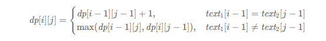

# 参考

1. 动态规划解题套路框架：https://labuladong.online/algo/essential-technique/dynamic-programming-framework-2/

# 基本方法
动态规划的核心是：base case + 状态转移放层 + 明确dp数组/函数的含义

> dp数组的核心是解决 **重叠子问题**

1. 什么是 **最优子结构** ? 无法通过子问题的最优值推出更大规模的问题的最优值，就不是最优子结构 => 调整子结构设计
2. 如何寻找遍历方向？ （a）遍历的过程中，所需的状态必须是已经计算出来的 (b) 遍历结束后，存储结果的那个位置必须已经被计算出来
3. 如何确定不合法索引的初始值？ 一般是根据求最大还是最小，确定一个相对不可能达到的小值 或者 大值

# 经典问题

## 子集划分

1. Q698:划分为k个相等的子集

## 单词拆分

1. Q139: 单词拆分


2. Q140: 单词拆分II


## 最小路径和

1. Q64: 最小路径和（只能向下或者向上）

一句话解法： (1)当i>0 且 j=0 时，`dp[i][0]=dp[i−1][0]+grid[i][0]` (2)当 i=0且j>0 时，`dp[0][j]=dp[0][j−1]+grid[0][j]`
(3) 当 i>0 且 j>0 时，`dp[i][j]=min(dp[i−1][j],dp[i][j−1])+grid[i][j]`

2. Q931: 下降路径最小和

一句话解法：`dp[i][j]`表示从第一行（`matrix[0][..]`）向下落，落到位置`matrix[i][j]`的最小路径和为`dp(matrix, i, j)`,
状态转移方程为 `dp(matrix, i, j) = matrix[i][j] + min(dp(matrix, i - 1, j), dp(matrix, i - 1, j - 1),  dp(matrix, i - 1, j + 1))`

## 两个字符串的动态规划问题

解决两个字符串的动态规划问题，一般都是用两个指针 i, j 分别指向两个字符串的最后，然后一步步往前移动，缩小问题的规模

1. Q72: 编辑距离: `dp[i][j]`表示两个字符串以i,j为最后指针时的编辑距离值，则有 

```java
// 状态转移
if (s1.charAt(i) == s2.charAt(j)) {
    return dp(s1, i - 1, s2, j - 1); // 啥都不做
}
return min(
    dp(s1, i, s2, j - 1) + 1,    // 插入
    dp(s1, i - 1, s2, j) + 1,    // 删除
    dp(s1, i - 1, s2, j - 1) + 1 // 替换
);
```

2. Q115: 不同的子序列

3. Q1143: 最长公共子序列LCS

一句话解法：`dp[i][j]`表示`s1[0..i]`与`s2[0..j]`的最长子序列，则有：



4. Q583: 两个字符串的删除，最少删除次数使一致

一句话解法：len(s1) + len(s2) - 2 * LCS(s1, s2)

5. Q712: 两个字符串的最小ASCII删除和

一句话解法：`dp[i][j]`表示`s1[0..i]`与`s2[0..j]`的最小ASCII删除和，则有


## 正则表达式匹配

1. Q10: 

## 背包问题及其变体

经典背包问题：N个物品 $weight_{i}$

1. Q494

## 鸡蛋掉落问题

1. 

## 划分字母空间

1. Q763: 划分字母空间

## 回文问题

1. 最长回文子串
2. Q516: 最长回文子序列
3. Q1312: 让字符串成为回文串的最少插入次数
4. 回文分割

## 打劫问题

## 石子游戏

## 零钱兑换

## 最大子数组

1. Q53: 最大子数组和

一句话解法：dp数组是表示以`nums[i]`结尾的最大子数组和，而不是`nums[0..i]`中的最大子数组和。则有 `dp[i] = max(nums[i], dp[i - 1] + nums[i])`

> 空间压缩技巧：由于 `dp[i]` 只与 `dp[i-1]`有关，所以只需要两个变量即可

```java
// base case
int dp_0 = nums[0];
int dp_1 = 0, res = dp_0;

for (int i = 1; i < n; i++) {
    // dp[i] = max(nums[i], nums[i] + dp[i-1])
    dp_1 = Math.max(nums[i], nums[i] + dp_0);
    dp_0 = dp_1;
    // 顺便计算最大的结果
    res = Math.max(res, dp_1);
}

return res;
```

## 最长递增子序列

1. Q300. 最长递增子序列

一句话解法：dp数组表示以对应位置结尾的最长递增子序列，则有下面的转移方程：

```Java
for (int i = 0; i < nums.length; i++) {
    for (int j = 0; j < i; j++) {
        // 寻找 nums[0..j-1] 中比 nums[i] 小的元素
        if (nums[i] > nums[j]) {
            // 把 nums[i] 接在后面，即可形成长度为 dp[j] + 1，
            // 且以 nums[i] 为结尾的递增子序列
            dp[i] = Math.max(dp[i], dp[j] + 1);
        }
    }
}
```

O(nlogn)算法：建立多个倒序的牌堆，新牌按照 搜索左侧边界的二分查找 找到对应的牌堆.

```java
int lengthOfLIS(int[] nums) {
    int[] top = new int[nums.length];
    // 牌堆数初始化为 0
    int piles = 0;
    for (int i = 0; i < nums.length; i++) {
        // 要处理的扑克牌
        int poker = nums[i];

        /***** 搜索左侧边界的二分查找 *****/
        int left = 0, right = piles;
        while (left < right) {
            int mid = (left + right) / 2;
            if (top[mid] > poker) {
                right = mid;
            } else if (top[mid] < poker) {
                left = mid + 1;
            } else {
                right = mid;
            }
        }
        /*********************************/
        
        // 没找到合适的牌堆，新建一堆
        if (left == piles) piles++;
        // 把这张牌放到牌堆顶
        top[left] = poker;
    }
    // 牌堆数就是 LIS 长度
    return piles;
}
```

2. Q354. 俄罗斯套娃信封问题

一句话解法：将信封按照宽升序排列，高降序排列，则套娃的最大序列就是高这个维度的数组的最长上升子序列。

因为宽度已经按照排序好了，高度由于是倒序，所以保证了同宽的信封不会嵌套

```java
public int maxEnvelopes(int[][] envelopes) {
    int n = envelopes.length;
    // 按宽度升序排列，如果宽度一样，则按高度降序排列
    Arrays.sort(envelopes, (int[] a, int[] b) -> {
        return a[0] == b[0] ? 
            b[1] - a[1] : a[0] - b[0];
    });
    // 对高度数组寻找 LIS
    int[] height = new int[n];
    for (int i = 0; i < n; i++)
        height[i] = envelopes[i][1];

    return lengthOfLIS(height);
}
```

## 股票买卖

1. Q121:买卖股票的最佳时机

一句话解法：记录历史最低价格`minprice`, 那么第`i`天的利润就是 `prices[i] - minprice`

2. Q122:买卖股票的最佳时机II，同一时间一只股票，允许当天买卖

一句话解法：计算所有上升趋势求和即可，即`if prices[i] > prices[i - 1] then profitSum += prices[i] - prices[i -1]`

3. Q123:买卖股票的最佳时机III,同一时间一只股票，最多两笔交易

一句话解法：

4. Q188:
5. Q309:
6. Q714: