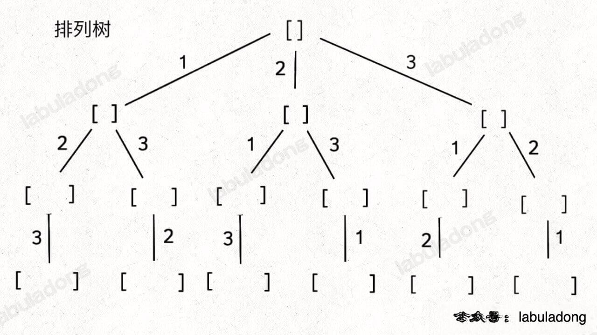

# 参考

1. https://labuladong.online/algo/essential-technique/backtrack-framework/
2. https://labuladong.online/algo/essential-technique/permutation-combination-subset-all-in-one/
3. https://labuladong.online/algo/practice-in-action/two-views-of-backtrack/

# 回溯算法基础

常用于排列组合类问题，其通用框架为：

```java
result = []
def backtrack(路径, 选择列表):
    if 满足结束条件:
        result.add(路径)
        return
    
    for 选择 in 选择列表:
        做选择
        backtrack(路径, 选择列表)
        撤销选择
```

**其核心就是 for 循环里面的递归，在递归调用之前「做选择」，在递归调用之后「撤销选择」**

从问题角度，回溯算法一般应用于 排列，组合和子集 三类问题，其中子集问题和组合问题是等价的。这其中关键的核心是记住 子集问题和排列问题 的回溯树




从条件角度，又常存在几类变体：

1. 元素不重复，不可复选
2. 元素可以重复，不可以复选
3. 元素不重复，可以复选


# 经典问题

## N皇后问题

// TODO

## 子集问题

子集的回溯实现：
```java
class Solution {
    List<List<Integer>> res = new LinkedList<>();
    // 记录回溯算法的递归路径
    LinkedList<Integer> track = new LinkedList<>();

    // 主函数
    public List<List<Integer>> subsets(int[] nums) {
        backtrack(nums, 0);
        return res;
    }

    // 回溯算法核心函数，遍历子集问题的回溯树
    void backtrack(int[] nums, int start) {
        // 前序位置，每个节点的值都是一个子集
        res.add(new LinkedList<>(track));
        // 回溯算法标准框架
        for (int i = start; i < nums.length; i++) {
            // 做选择
            track.addLast(nums[i]);
            // 通过 start 参数控制树枝的遍历，避免产生重复的子集
            // 注意这里是i+1, 不是start+1  !!!!!!
            backtrack(nums, i + 1);
            // 撤销选择
            track.removeLast();
        }
    }
}
```

核心是：用`start`参数来控制数值的生长，来避免产生重复的子集，用`track`记录根节点到每个节点的路径的值，同时在前序位置把每个节点的路径值收集起来，完成回溯树的遍历就收集了所有子集

1. Q78: 子集 （无重复，不可复选）
2. Q90: 子集II (可重复，不可复选)

一句话解法：对元素进行排序，然后迭代start的时候，重复元素只取一次, 对应下面的剪枝逻辑

```java
void backtrack(int[] nums, int start) {
    res.add(new LinkedList<>(track));
    for (int i = start; i < nums.length; i++) {
        // 剪枝逻辑，值相同的相邻树枝，只遍历第一条
        if (i > start && nums[i] == nums[i - 1]) {
            continue;
        }
        track.addLast(nums[i]);
        backtrack(nums, i + 1);
        track.removeLast();
    }
}
```


## 组合

```java
class Solution {

    List<List<Integer>> res = new LinkedList<>();
    // 记录回溯算法的递归路径
    LinkedList<Integer> track = new LinkedList<>();

    // 主函数
    public List<List<Integer>> combine(int n, int k) {
        backtrack(1, n, k);
        return res;
    }

    void backtrack(int start, int n, int k) {
        // base case
        if (k == track.size()) {
            // 遍历到了第 k 层，收集当前节点的值
            res.add(new LinkedList<>(track));
            return;
        }
        
        // 回溯算法标准框架
        for (int i = start; i <= n; i++) {
            // 选择
            track.addLast(i);
            // 通过 start 参数控制树枝的遍历，避免产生重复的子集
            backtrack(i + 1, n, k);
            // 撤销选择
            track.removeLast();
        }
    }
}

```

1. Q77: 组合（无重复，不可复选）: 类似子集
2. 

## 排列

```java
class Solution {

    List<List<Integer>> res = new LinkedList<>();
    // 记录回溯算法的递归路径
    LinkedList<Integer> track = new LinkedList<>();
    // track 中的元素会被标记为 true
    boolean[] used;

    /* 主函数，输入一组不重复的数字，返回它们的全排列 */
    public List<List<Integer>> permute(int[] nums) {
        used = new boolean[nums.length];
        backtrack(nums);
        return res;
    }

    // 回溯算法核心函数
    void backtrack(int[] nums) {
        // base case，到达叶子节点
        if (track.size() == nums.length) {
            // 收集叶子节点上的值
            res.add(new LinkedList(track));
            return;
        }

        // 回溯算法标准框架
        for (int i = 0; i < nums.length; i++) {
            // 已经存在 track 中的元素，不能重复选择
            if (used[i]) {
                continue;
            }
            // 做选择
            used[i] = true;
            track.addLast(nums[i]);
            // 进入下一层回溯树
            backtrack(nums);
            // 取消选择
            track.removeLast();
            used[i] = false;
        }
    }
}

```

1. Q46: 全排列（无重复，不可多选）： 使用used辅助数组来判断是否已经使用